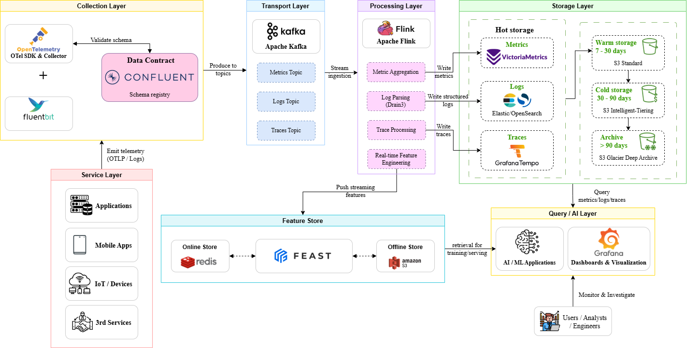

# Observability Platform Evaluation

## Architecture Diagram

## Architecture Decision Record (ADR) Summary

### Status
Accepted (2026-06-03)

### Context
The core system architecture has many applications. Telemetry data volume spans three scale levels. At the Medium scale, the system processes metrics from 100 services at 1,000,000 events per second. It also collects 500 GB of logs daily. These logs require storage up to 365 days for machine learning training. Standard SaaS options charge based on flat rates. This includes 0.10 USD per GB for log ingestion and 1.70 USD per GB for log retention. Projections show SaaS fees reach 4,800 USD per month at Small scale, 48,000 USD per month at Medium scale, and 480,000 USD per month at Large scale. This expense limits the budget available for analytical models.

### Decision
We will run an in house, unified Observability Data Layer. The stack runs on AWS EKS. It uses OpenTelemetry and Fluent Bit for collection. It uses Apache Kafka for transport. It uses Apache Flink for stream processing. It uses VictoriaMetrics for metrics. It uses Grafana Loki with multitier storage (EBS to AWS S3) for logs.

This design separates ingestion from storage. It allows data contract checks and tiered storage rules. Logs reside on block storage (EBS GP3) for 7 days. Then they are compressed to Parquet format and sent to S3 Standard for long term storage. This enables batch queries via Amazon Athena.

### Consequences
* **Cost Reduction:** AWS resource costs are lower. At Medium scale, self hosting requires 6,206.07 USD per month. Adding one dedicated SRE at 5,000.00 USD per month brings the total cost of ownership to 11,206.07 USD per month. This saves money compared to the SaaS option.
* **Control:** OpenTelemetry standards let us send signals to different backends. We can change cloud providers without modifying application code.
* **ML Synergy:** Stream processing via Apache Flink sends features to the Feast Feature Store. S3 Parquet files feed offline training. This reduces training serving drift.
* **Operational Overhead:** The team must manage stateful distributed parts like Apache Kafka and Flink. Errors in setup can cause ingestion delays or data loss.
* **Time to Market:** Building this pipeline requires 1 to 2 months of engineering time. A SaaS option integrates immediately.
* **Latency:** Ingestion via Kafka adds 10 to 25 milliseconds of processing time. This is acceptable for analytical processing.

### Alternatives Considered
1. **Full SaaS Adoption:** Rejected because of high costs at scale. It would force data limits and create visibility gaps.
2. **Hybrid Solution (Prometheus and SaaS Logs):** Rejected because it splits the telemetry data. This makes debugging more difficult.
3. **Grafana Stack without Kafka or Flink:** Rejected because direct ingestion can drop data during spikes. Omitting Flink prevents parsing and feature calculation.

## Cost Estimation

The following tables show the cost models computed by [cost_model.py](file:///e:/AIO/Project/repo-aiops-minhtq/w1/d3/cost_model.py).

### Build Cost Breakdown (Self Hosted Stack)

| Scale | Compute (USD) | Storage (USD) | Network (USD) | Infra Total (USD) | SRE Cost (USD) | Total TCO (USD) |
| :--- | :--- | :--- | :--- | :--- | :--- | :--- |
| Small | 307.00 | 302.27 | 153.84 | 763.11 | 0.00 | 763.11 |
| Medium | 1645.00 | 3022.68 | 1538.39 | 6206.07 | 5000.00 | 11206.07 |
| Large | 14965.00 | 30226.81 | 15383.93 | 60575.74 | 15000.00 | 75575.74 |

### Build vs Buy Cost Comparison

| Scale | Build TCO (USD) | Buy (SaaS) (USD) | Monthly Savings (USD) | Savings (%) |
| :--- | :--- | :--- | :--- | :--- |
| Small | 763.11 | 4800.00 | 4036.89 | 84.10% |
| Medium | 11206.07 | 48000.00 | 36793.93 | 76.65% |
| Large | 75575.74 | 480000.00 | 404424.26 | 84.26% |

## Platform Engineer Reflection

If hired as a Platform Engineer for a startup with 50 services that just completed a Series A funding round, I would recommend buying a SaaS solution rather than building a self hosted platform.

### Reasons for Recommending Buy

1. **Focus on Core Product Development**
At the Series A stage, the primary objective is to find product market fit and scale features. Allocating engineering resources to build and maintain an internal observability stack distracts from the core product.

2. **Operational Overhead and Personnel Cost**
Running a self hosted stack with Kafka, Flink, and EKS requires dedicated operational knowledge. The monthly salary of a single SRE is around 5,000 USD. This is higher than the SaaS subscription cost for 50 services at a small scale. Hiring specialists is more expensive than paying for SaaS.

3. **Reliability and Service Level Agreements**
SaaS providers offer high availability and managed scale. A startup team might lack the experience to prevent data loss or ingestion delays during sudden traffic peaks.

4. **Time to Value**
SaaS integration takes days. Building, benchmarking, and securing an in house telemetry pipeline takes months of engineering time.