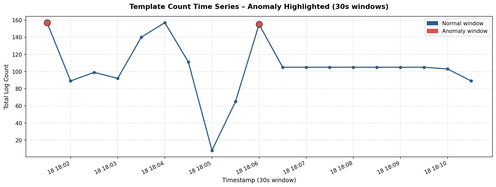

# Log Parsing and Anomaly Detection Report

Dataset: Hadoop_2k.log, Zookeeper_2k.log
Period: October 2015 (Hadoop) & July-August 2015 (Zookeeper)
Interval: Variable / 30 seconds grouping for time series
Total lines: 2,000 lines per dataset

---

## 1. Screenshots

### 1.1 Instructions for Generating and Capturing Plots
To generate the template count time series plot with highlighted anomalies, please run the following Python code snippet in your Jupyter Notebook (`assignment.ipynb`):

```python
import matplotlib.pyplot as plt
import os

# Sum log volume per time window
total_volume = df_timeseries.drop(columns=['anomaly_score'], errors='ignore').sum(axis=1)
anomaly_windows = df_timeseries[df_timeseries['anomaly_score'] == -1]
anomaly_volume = total_volume.loc[anomaly_windows.index]

plt.figure(figsize=(12, 6))
plt.plot(total_volume.index, total_volume.values, label='Total Log Volume', color='#2b5c8f', marker='o', linewidth=2)
plt.scatter(anomaly_volume.index, anomaly_volume.values, color='#d9534f', label='Anomaly Highlighted', s=120, zorder=5, edgecolors='black')

plt.title('Log Template Count Time Series with Anomalies Highlighted', fontsize=14, fontweight='bold', pad=15)
plt.xlabel('Time Window (30s)', fontsize=12)
plt.ylabel('Log Count', fontsize=12)
plt.grid(True, linestyle='--', alpha=0.5)
plt.legend(frameon=True, facecolor='white', edgecolor='none', fontsize=11)
plt.xticks(rotation=30)
plt.tight_layout()

# Save the plot
os.makedirs('assets', exist_ok=True)
plt.savefig('assets/timeseries_anomaly.png', dpi=300)
plt.show()
```

Once the plot is generated:
1. Capture the plot output.
2. Save it at the location: `w1/day-b/assets/timeseries_anomaly.png`.
3. Uncomment the image reference below in `SUBMIT.md`.

### 1.2 Template Count Time Series (Anomaly Highlighted)


---

## 2. Comparison Table

### 2.1 Dataset Comparison Table

| Metric | Hadoop_2k.log | Zookeeper_2k.log |
| :--- | :--- | :--- |
| **Total Lines** | 2,000 | 2,000 |
| **Parsed Lines** | 2,000 (100%) | 2,000 (100%) |
| **Unique Templates** | 103 | 46 |
| **Time Range** | 2015-10-18 18:01:47 to 18:10:55 (~9 mins) | 2015-07-29 17:41:44 to 2015-08-25 11:26:28 (~27 days) |
| **Top Template Count** | 476 (23.8%) | 314 (15.7%) |
| **Avg Logs / Hour** | ~13,333 | ~3.1 |

### 2.2 Why Hadoop has more unique templates than Zookeeper:
1. **Log Verbosity & Scope**: Hadoop logs capture complex execution steps of MapReduce jobs (MRAppMaster initialization, token handling, committer setup, task attempt status transitions, ResourceManager heartbeats, and connection retries), involving many different modules and events.
2. **Repetitiveness**: Zookeeper is a coordination service whose steady-state behavior is extremely uniform (mostly heartbeat checks, queue waiting, and worker state transitions), resulting in highly repetitive logs even over a 27-day span.

---

## 3. Tuning Log

### 3.1 Drain3 `drain_sim_th` Tuning Results

Grid search parameter `drain_sim_th` (similarity threshold) evaluated on `Hadoop_2k.log`:

| Similarity Threshold (`sim_th`) | Total Templates Mined | Execution Time (seconds) |
| :--- | :--- | :--- |
| **0.3** | 98 | 0.03 |
| **0.5 (Best/Default)** | 103 | 0.03 |
| **0.7** | 170 | 0.03 |

### 3.2 Tuning Observations
- **Low Threshold (`sim_th = 0.3`)**: Too loose. Messages with distinct semantic structures get merged into single templates (e.g. merging different exceptions or unrelated states together), losing valuable diagnostic context.
- **High Threshold (`sim_th = 0.7`)**: Too strict. Minor differences (such as port numbers, hostnames, or specific variable formats that aren't recognized as wildcards) cause Drain3 to split them into separate templates, causing "template explosion" (170 templates for only 2,000 lines).
- **Optimal Choice (`sim_th = 0.5`)**: Successfully generalizes variable parameters (IPs, task IDs, attempt IDs, ports) while retaining the structural essence of distinct log event categories.

---

## 4. Log Analyzer Output

### 4.1 Top-10 Templates for Hadoop Log (from Jupyter Notebook & CSV)

| Template ID | Frequency | Percentage | Mined Template Pattern |
| :--- | :--- | :--- | :--- |
| **89** | 476 | 23.8% | `Address change detected. Old: <*> New: <*>` |
| **90** | 326 | 16.3% | `Failed to renew lease for [DFSClient_NONMAPREDUCE_1537864556_1] for <*> seconds. Will retry shortly ...` |
| **72** | 289 | 14.4% | `Progress of TaskAttempt <*> is : <*>` |
| **95** | 147 | 7.3% | `ERROR IN CONTACTING RM.` |
| **96** | 146 | 7.3% | `Retrying connect to server: msra-sa-41:8030. Already tried 0 time(s); retry policy is ...` |
| **52** | 131 | 6.6% | `Recalculating schedule, <*> <*>` |
| **53** | 130 | 6.5% | `Reduce slow start threshold not met. completedMapsForReduceSlowstart 1` |
| **46** | 39 | 2.0% | `Resolved <*> to /default-rack` |
| **61** | 28 | 1.4% | `<*> TaskAttempt Transitioned from <*> to <*>` |
| **47** | 25 | 1.3% | `<*> <*> Transitioned from NEW to <*>` |

### 4.2 Script Command Execution & Output Logs

#### Run log_analyzer.py on Hadoop
```bash
python log_analyzer.py data/Hadoop_2k.log
```
Output:
```text
============================================================
  Log Analyzer — data/Hadoop_2k.log
============================================================

[1] TỔNG QUAN
    Tổng dòng log       : 2,000
    Dòng parse được     : 2,000  (0 dòng bỏ qua)
    Unique templates    : 103
    Thời gian bắt đầu   : 2015-10-18 18:01:47
    Thời gian kết thúc  : 2015-10-18 18:10:55

[2] TOP-5 TEMPLATES (theo tần suất)
    #1  [ID=  89]  count=  476  ( 23.8%)  Address change detected. Old: <*> New: <*>
    #2  [ID=  90]  count=  326  ( 16.3%)  Failed to renew lease for [DFSClient_NONMAPREDUCE_1537864556_1] for <*> secon...
    #3  [ID=  72]  count=  289  ( 14.4%)  Progress of TaskAttempt <*> is : <*>
    #4  [ID=  95]  count=  147  (  7.3%)  ERROR IN CONTACTING RM.
    #5  [ID=  96]  count=  146  (  7.3%)  Retrying connect to server: msra-sa-41:8030. Already tried 0 time(s); retry p...

[3] SPIKE TEMPLATES trong 1 giờ gần nhất (> 3× trung bình trước đó)
    Mốc thời gian cắt   : 2015-10-18 17:10:55
    → Không phát hiện spike đáng kể.

[4] NEW TEMPLATES trong 1 giờ gần nhất (103 templates)
    [ID=   1]  Created MRAppMaster for application appattempt_1445144423722_0020_000001
    [ID=   2]  Executing with tokens:
    [ID=   3]  Kind: YARN_AM_RM_TOKEN, Service: , Ident: (appAttemptId { application_id { id...
    [ID=   4]  Using mapred newApiCommitter.
    [ID=   5]  OutputCommitter set in config null
    [ID=   6]  OutputCommitter is org.apache.hadoop.mapreduce.lib.output.FileOutputCommitter
    [ID=   7]  Registering class <*> for class <*>
    [ID=   8]  Default file system [hdfs://msra-sa-41:9000]
    [ID=   9]  Emitting job history data to the timeline server is not enabled
    [ID=  10]  loaded properties from hadoop-metrics2.properties
    ... và 93 template mới khác.

============================================================
```

#### Run log_analyzer.py on Zookeeper
```bash
python log_analyzer.py data/Zookeeper_2k.log
```
Output:
```text
============================================================
  Log Analyzer — data/Zookeeper_2k.log
============================================================

[1] TỔNG QUAN
    Tổng dòng log       : 2,000
    Dòng parse được     : 2,000  (0 dòng bỏ qua)
    Unique templates    : 46
    Thời gian bắt đầu   : 2015-07-29 17:41:44
    Thời gian kết thúc  : 2015-08-25 11:26:28

[2] TOP-5 TEMPLATES (theo tần suất)
    #1  [ID=   4]  count=  314  ( 15.7%)  Interrupted while waiting for message on queue
    #2  [ID=   2]  count=  299  ( 14.9%)  Received connection request <*>
    #3  [ID=   5]  count=  291  ( 14.5%)  Connection broken for id <*> my id = <*> error =
    #4  [ID=   6]  count=  266  ( 13.3%)  Interrupting SendWorker
    #5  [ID=   3]  count=  262  ( 13.1%)  Send worker leaving thread

[3] SPIKE TEMPLATES trong 1 giờ gần nhất (> 3× trung bình trước đó)
    Mốc thời gian cắt   : 2015-08-25 10:26:28
    → Không phát hiện spike đáng kể.

[4] NEW TEMPLATES trong 1 giờ gần nhất (2 templates)
    [ID=  43]  Reading snapshot /var/lib/zookeeper/version-2/snapshot.b00000084
    [ID=  44]  Sending DIFF

============================================================
```

---

## 5. Reflection

### 5.1 Drain3 Parsing Assessment
- **Performance & Accuracy**: Drain3 parses logs exceptionally well and fast, taking less than `0.03s` to structure `2000` raw log lines. It accurately replaces dynamic content (e.g., attempt IDs, timestamps, ports) with wildcards `<*>`.
- **Key Dependencies**:
  - **Pre-cleaning**: Removing timestamp prefixes and standard headers is *critical*. Leaving timestamps or thread names in the log strings processed by Drain3 causes massive template explosion, as each line gets treated as a new template.
  - **Tuning**: The configuration param `drain_sim_th` is highly sensitive and requires dataset-specific adjustments.

### 5.2 Templates of Significant Insight (Root Cause Analysis)
- **Hadoop Network/Connectivity Failures**:
  - `ID 95`: `ERROR IN CONTACTING RM.` (RM = ResourceManager)
  - `ID 96`: `Retrying connect to server: msra-sa-41:8030. Already tried 0 time(s); retry policy is...`
  - `ID 89`: `Address change detected. Old: <*> New: <*>`
  - **Insight**: Together, these patterns signal a severe network disconnection or ResourceManager crash in the cluster. The worker node is completely cut off from RM and repeatedly retrying, leading to job stalls.
- **Hadoop HDFS Lease Renewal Failures**:
  - `ID 90`: `Failed to renew lease for [DFSClient_NONMAPREDUCE_1537864556_1] for <*> seconds. Will retry shortly ...`
  - **Insight**: HDFS lease renewal fails, indicating the client could not communicate with the NameNode or local data streams got interrupted due to network congestion or server overload.

### 5.3 Metrics vs. Logs in Anomaly Detection

| Characteristic | Metrics (e.g. CPU, Latency, Throughput) | Logs (e.g. System/App Log Events) |
| :--- | :--- | :--- |
| **Data Nature** | Continuous, low-dimensional numerical time series. | High-dimensional, structured/unstructured discrete text. |
| **Processing Cost** | Very low (can be computed in real-time instantly). | Medium (requires parsing, text processing, vectorization). |
| **Detection Target** | Volume/statistical spikes, drift, threshold violations. | Novel/unexpected events, state-transition errors. |
| **Role in Troubleshooting** | **Symptom Detector**: Identifies *when* the system got slow/degraded (e.g., latency spikes). | **Root Cause Explainer**: Identifies *why* the system failed (e.g., exact class stack trace). |
| **Anomaly Type** | Quantitative (value spikes, distribution shifts). | Qualitative (new event types, broken sequences). |
